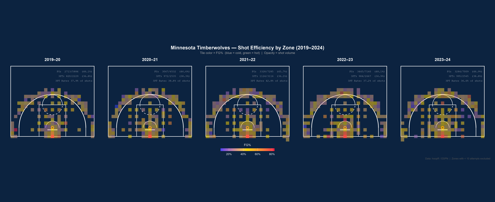

```{r, setup, include=FALSE}
knitr::opts_chunk$set(out.width = '80%', collapse = TRUE, warning=FALSE, message=FALSE)
library(tidyverse)
```


### Minnesota Timberwolves — Shot Efficiency by Zone (2019–2024)

```{r fig-chart, echo=FALSE, out.width="100%", fig.cap="Shot efficiency heat map by zone. Tile color = FG% (blue = cold, green = hot); opacity = shot volume. Zones with fewer than 10 attempts excluded."}

```

---

### Key Findings

<div class="finding-box">📈 <b>Overall FG% climbed steadily</b> — from 46.1% in 2019–20 to a peak of 48.1% in 2022–23, reflecting improved shot selection and roster development under Chris Finch.</div>

<div class="finding-box">🎯 <b>Paint dominance is elite (Contrary to what people on twitter might say about Gobert)</b> — the restricted area burns hot (60–80%+ FG) across all five seasons, anchoring the offense. Volume in that zone remained high throughout.</div>

<div class="finding-box">📉 <b>Mid-range efficiency</b> — the mid-range zones appear blue in every season, indicating below-average conversion rates. Shot volume in these areas has been moderate but largely unproductive. Have improved slightly over time, could be due to Edwards blossoming into a superstar</div>

<div class="finding-box">🔄 <b>Three-point rate</b> — three-point attempts jumped from 37.9% of all shots (2019–20) to a peak of 42.8% (2021–22), then settled near 36–38% in the final two seasons, suggesting a deliberate pull-back toward more efficient shot types, also change in play style from development of Mcdaniels to Edwards</div>

<div class="finding-box">📐 <b>Corner three</b> - Across all seasons, corner three tiles are consistently warmer than above-the-break threes, yet corner volume remains lower than league-best offenses typically generate. Likely due to Point Guards (Conley, Russel, etc.) play from the top of the paint and less scoring from wing positions</div>

<div class="finding-box">🏀 <b>2022–23 was the team's best shooting season</b> — 48.1% FG overall with the lowest three-point rate (37.2%), suggesting the team leaned into high-percentage twos more effectively than in other years. Which was also the first year in which Gobert was on the team</div>

---

## Detailed Findings

### 1 — Overall FG% Trend

The team's overall FG% improved from **46.1% in 2019–20** through a brief dip in 2020–21 (46.6%) and 2021–22 (45.7%), before reaching a five-season high of **48.1% in 2022–23**. The 2023–24 season came in at 46.9%, still above the franchise's earlier baseline.

This trajectory aligns with roster maturation: Karl-Anthony Towns developed a more efficient mid-range and post game different then his younger years in which the team struggled, Anthony Edwards emerged as a shot creator who attacks the rim at a high rate along with a high 3 PT %, and Rudy Gobert's arrival in 2022–23 dramatically changed the paint picture by spacing the floor for others and converting near the basket at elite rates. Also Chris Finch's development into one of the leagues best coaches has allowed for these players to thrive in a high scoring offense(and even better defense).


---   


### 2 — Paint Dominance

The restricted-area tiles are the single most consistent feature across all five shot charts. Conversion rates in this zone range from roughly **60–80%+**, far above league average for any other zone. The team has maintained high volume here regardless of personnel changes, suggesting the offensive system is explicitly designed to generate these attempts.

Seasons with Towns and later Gobert has helped the team become one of the most dominant forces upon the rim (Not even mentioning the arrival of Randle)


---


### 3 — Mid-Range Cold Zones

The elbow and mid-post regions consistently appear in blue-to-purple (below ~40% FG), representing the least efficient shot type the team generates. Despite this, modest shot volume persists in these zones — likely a byproduct of shot clock pressure, broken possessions, and pull-up opportunities for guards.

Limiting the mid range is the most effective use of this data in the modern NBA as the risk reward is too high as opposed to a higher percentage shot up close. The team has already begun to seek these measures as McDaniels is developing ever so nicely into a 3 and D with offensive upside.


---


### 4 — Three-Point Rate Evolution

The three-point rate tells a clear story of experimentation followed by recalibration:

- **2019–20:** 37.9% of shots were threes — a baseline reflecting a mid-transition team.
- **2020–21:** Rate held at 38.8%.
- **2021–22:** Peaked at **42.8%** — the team leaned heavily into the three-ball, but three-point percentage dipped to 36.1%, the lowest of the window. Finishing with a league best offense yet 24th ranked defense
- **2022–23 & 2023–24:** Rate pulled back to 37.2% and 36.6% respectively, with conversion stabilizing near 37–39%.

The rates in 3's albeit different have held pretty consistently with all things considered. 2021-2022 Saw a peak of 3's and offense, yet one of th eleagues worst offenses and less efficient game. The shift over the next two years signals a deliberate shift in style into a more defensive structure with increased ball movement and scheming.


---


### 5 — Corner Three Efficiency

Though difficult to isolate in a binned zone chart, the corner-three tiles (the zones along the sideline below the break) are consistently among the warmest three-point locations.

**Opportunity:** The data suggests the team could benefit from increased corner-three generation — through more drive-and-kick actions, or roster decisions that prioritize floor-spacing "dunker spot" players who relocate to corners off drives.


---


### 6 — 2022–23 as Peak Season

The 2022–23 season stands out across multiple dimensions:

- Highest overall FG% (48.1%)
- Lowest three-point rate (37.2%), suggesting higher two-point efficiency
- Visual chart shows warm tiles spreading further into the paint and short-roll zones

This was Gobert's first season in Minnesota. His presence both as a screener and a roll-man created more high-percentage two-point opportunities — the data supports the hypothesis that his addition meaningfully improved the offense's shot quality profile, at least in year one.

---


 The Background

Your role for the midterm project is that of data analyst intern at an NBA (professional basketball) team. Your direct supervisor (also part of the analytics team) has asked you to create a data visualization to illustrate how (or if) the team's shots have changed over time. After some initial clarifying questions, your supervisor confessed that they had seen some pretty cool shot charts at http://savvastjortjoglou.com/nba-shot-sharts.html and would like to extend the ideas a bit. 

Your data for the midterm project may come from a variety of sources, including the NBA directly, as well as Basketball-Reference, HoopsHype, and others. There are several ways to access the data, but perhaps the simplest is through a package. There are a few options (each with some benefits, drawbacks, and potential headaches):

- `nbastatR`
- `hoopR`
- `AdvancedBasketballStats`

Note: if you would prefer to analyze college basketball, packages exist for that too (such as `cbbdata`). If you would prefer to look into a different sport, we can investigate that as well. Please let me know in advance if you intend to go down one of these alternate routes. 


```{r}
library(tidyverse)
library(hoopR)

# DeDuplicate the load
# hoopR loads each play twice (once per team perspective), had a major issue (Biggest of the project) and had to ask multiple people and AI to help but finally figured it out, this method isn't foolproof, but for my computer (and not wanting it to explode) this was the fastest and most consistent method I found
# arranging by sequence_number and slicing every other row removes duplicates
shots_raw = hoopR::load_nba_pbp(seasons = 2020:2024)

shots = shots_raw %>%
  arrange(game_id, sequence_number) %>%
  slice(seq(1, n(), by = 2))

# Filter to Timberwolves regular season only 
twolves = shots %>%
  filter(home_team_name == "Minnesota" | away_team_name == "Minnesota") %>%
  filter(season_type == 2)

#Clean & transform coordinates using ESPN as a baseline
# ESPN coords: x = 0-50 (width), y = 0-47 (half-court depth), units in feet, hoopR in essence is similar although not the exact same, had some issues with the 3 pointers that you will see I documented later on
# Rescale to tenths of feet, centered at hoop (x = 0)
# Hoop sits at (0, 52.5) — 5.25 ft from baseline

shots_clean = twolves %>%
  filter(shooting_play == TRUE) %>%
  filter(!str_detect(type_text, "Free Throw")) %>%
  mutate(
    x  = (as.numeric(coordinate_x_raw) - 25) * 10,
    y  = as.numeric(coordinate_y_raw) * 10,
    scored  = score_value > 0,
    dist = sqrt(x^2 + (y - 52.5)^2),
    is_three = case_when(
      score_value == 3 ~ TRUE,    # made 3 — happened due to scoring play
      score_value == 2 ~ FALSE,   # made 2 — also happened due to scoring play
      dist > 200       ~ TRUE,    # missed shot that was a 3, had to change classification as using the classic nba 3pt line of 22 ft, or 220 in this case, it had 1500 3 pointers which was nearly 700 short this number was a lot closer to the real total
      TRUE             ~ FALSE    # finally other missed shots
    ),
    season_label = paste0(season - 1, "–", str_sub(as.character(season), 3, 4))
  ) %>%
  filter(!is.na(x), !is.na(y))

# Pre-bin shots into zones & compute FG% per zone
# Bin width of 20 (2 feet) balances zone resolution vs sample size. Because of this much of the mid range is unused or unrepresented in the graphing as it takes up a much smaller portion of the shot data as opposed to 3 pointers and close shots, highlighting the disparity in where shots are taken in the NBA
# Zones with fewer than 10 attempts are dropped as unreliable
zone_stats = shots_clean %>%
  mutate(
    x_bin = round(x / 20) * 20,
    y_bin = round(y / 20) * 20
  ) %>%
  group_by(season_label, x_bin, y_bin) %>%
  summarise(
    attempts = n(),
    fg_pct = mean(scored, na.rm = TRUE),
    .groups = "drop"
  ) %>%
  filter(attempts >= 10)

# Per-season summary stats for annotation labels
season_stats = shots_clean %>%
  group_by(season_label) %>%
  summarise(
    attempts = n(),
    makes = sum(scored,            na.rm = TRUE),
    fg_pct = round(makes / attempts * 100, 1),
    three_att  = sum(is_three,          na.rm = TRUE),
    three_made = sum(is_three & scored, na.rm = TRUE),
    three_rate = round(three_att / attempts   * 100, 1),
    three_pct  = round(three_made / three_att * 100, 1),
    .groups = "drop"
  ) %>%
  mutate(
    label = paste0(
      "FG:  ", makes, "/", attempts, "  (", fg_pct, "%)\n",
      "3PT: ", three_made, "/", three_att, "  (", three_pct, "%)\n",
      "3PT Rate: ", three_rate, "% of shots"
    )
  )

# Court geometry 
# All units in tenths of feet, hoop at (0, 52.5)
# 3PT arc uses radius 200 to match the dist > 200 classification threshold above —
# keeping the visual boundary honest to what the data actually uses, got help with this section as the geometry of the court was complicated and very hard for me to visualize how to make it
arc_df = function(cx, cy, r, a1, a2, n = 300) {
  data.frame(
    x = cx + r * cos(seq(a1, a2, length.out = n)),
    y = cy + r * sin(seq(a1, a2, length.out = n))
  )
}

three_pt_arc  = arc_df(0, 52.5, 200,
                         0, pi)
ft_circle_top = arc_df(0, 190,   60, 0,      pi)
ft_circle_bot = arc_df(0, 190,   60, pi,     2 * pi)
restricted  = arc_df(0, 52.5,  40, 0,      pi)
hoop_circle = arc_df(0, 52.5, 7.5, 0,      2 * pi)

court_lines = list(
  annotate("rect",    xmin = -250, xmax = 250, ymin = 0, ymax = 422,
           fill = NA, color = "white", linewidth = 0.7),
  annotate("rect",    xmin = -80,  xmax = 80,  ymin = 0, ymax = 190,
           fill = NA, color = "white", linewidth = 0.6),
  annotate("segment", x = -30, xend = 30, y = 40, yend = 40,
           color = "white", linewidth = 1.2),
  geom_path(data = hoop_circle,   aes(x, y), inherit.aes = FALSE,
            color = "#FF6B00", linewidth = 1.1),
  geom_path(data = restricted,    aes(x, y), inherit.aes = FALSE,
            color = "white", linewidth = 0.6),
  geom_path(data = ft_circle_top, aes(x, y), inherit.aes = FALSE,
            color = "white", linewidth = 0.6),
  geom_path(data = ft_circle_bot, aes(x, y), inherit.aes = FALSE,
            color = "white", linewidth = 0.6, linetype = "dashed"),
  geom_path(data = three_pt_arc,  aes(x, y), inherit.aes = FALSE,
            color = "white", linewidth = 0.9),
  # arc radius is 200 centered at (0, 52.5), so endpoints land at (±200, 52.5) —
  # corner segments need to be at x = ±200 running from baseline up to y = 52.5
  # to connect flush with where the arc actually ends, no gap
  annotate("segment", x = -200, xend = -200, y = 0, yend = 52.5,
           color = "white", linewidth = 0.7),
  annotate("segment", x =  200, xend =  200, y = 0, yend = 52.5,
           color = "white", linewidth = 0.7)
)

# Build plot 
p = ggplot(zone_stats, aes(x = x_bin, y = y_bin)) +
  court_lines +
  geom_tile(
    aes(fill  = fg_pct,
        alpha = attempts),
    width  = 20,
    height = 20
  ) +

  scale_fill_gradient2(
    low = "#0040FF",
    mid = "#FFD700",
    high = "#FF1744",
    midpoint = 0.45,
    name     = "FG%",
    labels   = scales::percent,
    guide    = guide_colorbar(
      title.position = "top",
      barwidth       = 12,
      barheight      = 0.6,
      title.hjust    = 0.5
    )
  ) +

  # shot attempts already communicated through tile opacity so the legend
  # isn't adding anything — removing it to clean up the bottom of the plot
  scale_alpha_continuous(
    range = c(0.5, 1),
    guide = "none"
  ) +

  geom_label(
    data = season_stats,
    aes(label = label),
    x = 245,
    y = 400,
    inherit.aes = FALSE,
    color = "white",
    fill  = "#0C2340CC",
    label.size  = 0,
    size = 2.9,
    hjust = 1,
    vjust = 1,
    lineheight  = 1.5,
    family = "mono"
  ) +

  coord_fixed(xlim = c(-260, 260), ylim = c(-10, 420)) +

  facet_wrap(~season_label, nrow = 1) +

  labs(
    title = "Minnesota Timberwolves — Shot Efficiency by Zone (2019–2024)",
    subtitle = "Tile color = FG%  (blue = cold, green = hot)  |  Opacity = shot volume",
    caption  = "Data: hoopR / ESPN  |  Zones with < 10 attempts excluded"
  ) +

  theme_void(base_size = 13) +
  theme(
    plot.background  = element_rect(fill = "#0C2340", color = NA),
    panel.background = element_rect(fill = "#0C2340", color = NA),
    strip.text = element_text(color = "white", face = "bold",
                                    size = 13, margin = margin(b = 5)),
    plot.title = element_text(color = "white", face = "bold",
                                    size = 16, hjust = 0.5,
                                    margin = margin(t = 12, b = 4)),
    plot.subtitle = element_text(color = "#AAAAAA", size = 10,
                                    hjust = 0.5, margin = margin(b = 10)),
    plot.caption = element_text(color = "#555555", size = 8, hjust = 1),
    legend.position  = "bottom",
    legend.title = element_text(color = "white", size = 10),
    legend.text  = element_text(color = "white", size = 9),
    plot.margin = margin(10, 15, 10, 15)
  )

##ggsave("twolves_shot_chart_efficiency.png", p,
       ##width = 22, height = 9, dpi = 300, bg = "#0C2340")
```


## The Tasks

1. (30 points) Produce a graphic displaying the shot locations for a particular team over several years. Some notes:

   - Colors should be chosen to reflect the team, if possible.
   - There are likely many overlaid points -- handle this by either binning these by location, or use opacity and size.
   - Incorporate information about whether the shot was made or not (shape, color, etc.).
   - The graphic should be well-labeled, titled, etc.
   - Start with a graph for a single year, then extend to several years. Up to 20 years of shot data is available. Either facet these by year or animate using the years.
   - You'll want to figure out what the coordinates mean somehow. This might be through the documentation, but could also be determined using aspects of the data itself and the dimensions of an NBA court.
    - Put a basketball court on the background of the image (you'll need to scale it appropriately).
    
   
2. (30 points) Summarize the graphic/series of graphics into a digestible, bullet-point brief report for front-office staff. Some notes:

   - The main body of the report should be very brief -- just the graphic(s) and the bullet-pointed list of findings, which should be short and clear.
   - Include a more detailed explanation of these bullet points, for further reading by those interested. This section should follow the bullet-point section, but should be organized similarly for reference. 
   - Your report to the front-office shouldn't include any code.
   - This report should be generated using RMarkdown. However, the choice of output type (Word, PDF, or HTML) is up to you (you could even make slides if you want to). 
   
3. (30 points) Write and document clean, efficient, reproducible code. Some notes:

   - This code will be viewed by your direct supervisor.
   - The code file should include your code to gather, join, and clean the data; the code to generate the graphic(s) presented; and your commentary on the results (so, a single .rmd file, or an .rmd file that sources an .r file).
   - Your code should be clean, organized, and reproducible. Remove unnecessary/scratch/exploratory code.
   - Your code should be well commented. In particular, any decisions or judgement calls made in the analysis process should be explained/justified. Sections of code should be identified even if not functionalized (including purpose, data/argument inputs, analysis outputs).
   
4. (10 points) Above and Beyond. Choose either option below. You are welcome to explore both, but only one is required. 

  - Option 1: Explore the data a bit, and create a graphic that uses (or incorporates) different information than what was used above. Some notes:
    - Create an additional graphic that incorporates at least one additional variable not previously used (this should add to the graphic in part 1). The additional data should be drawn from a different dataset (function call) than the original graphic used. These two (or more) datasets may need to be joined appropriately.
    - You can either add more information to the plot above, or create a different plot. 
     - Formatting, labelling, etc. are all important here too.
    - Adding marginal densities or other "bells and whistles" might offer additional insight.
    - This graphic should be included at the end of the report (after the more detailed explanations). 
     - You should include a brief description of the graphic (highlighting the different/additional information used).
  - Option 2: If the NBA were to incorporate a 4-point shot, where would you draw a 4-point arc? Some notes:
    - You likely should base your decision at least partly on proportion of shots made from a given range. You might consider an expected value calculation here.
    - Your arc can be shaped as you see fit; simple arcs are sufficient for this exploration.
    - Provide an example of a consequence (positive or negative) if a 4-point shot was incorporated. (e.g., "my_favorite_player's season point total would increase by x%")
    - You do not need to create a plot representing your arc, though you are welcome to do so!

  
## The Deliverables

1. Upload your report and code file(s) to GitHub by 5:00pm on Friday, April 3.
2. Submit (on Canvas) your report, code, and link to your GitHub repository by 5:00pm on Friday, April 3.
  
  
  
  


